# nest-hex Library Documentation

## Table of Contents

- [Core Concepts](#core-concepts)
- [Why Hexagonal Architecture?](#why-hexagonal-architecture)
- [Architecture Overview](#architecture-overview)
- [API Reference](#api-reference)
  - [@Adapter Decorator](#adapter-decorator)
  - [Adapter Class](#adapter-class)
  - [@InjectPort Decorator](#injectport-decorator)
  - [PortModule Class](#portmodule-class)
  - [AdapterModule Type](#adaptermodule-type)
- [Getting Started](#getting-started)
- [Advanced Usage](#advanced-usage)
  - [Adapters with Dependencies](#adapters-with-dependencies)
  - [Async Configuration](#async-configuration)
  - [Multiple Adapters](#multiple-adapters)
  - [Environment-Specific Adapters](#environment-specific-adapters)
- [Testing](#testing)
  - [Mock Adapters](#mock-adapters)
  - [Integration Testing](#integration-testing)
- [Migration Guide](#migration-guide)
  - [From @Port to @Adapter](#from-port-to-adapter)
- [Examples](#examples)

---

## Core Concepts

**nest-hex** helps you build NestJS applications following the **Ports & Adapters** (Hexagonal Architecture) pattern. Here are the key concepts:

### Port
A **port** is a domain interface that defines what your application needs from infrastructure. It's represented by a **token** (typically a `Symbol` or string) that you use for dependency injection.

```typescript
// Define a port token
export const OBJECT_STORAGE_PORT = Symbol('OBJECT_STORAGE_PORT')

// Define the port interface
export interface ObjectStoragePort {
  upload(key: string, data: Buffer): Promise<string>
  download(key: string): Promise<Buffer>
  delete(key: string): Promise<void>
}
```

### Adapter
An **adapter** is an infrastructure implementation that fulfills a port. Adapters hide implementation details (AWS S3, Azure Blob, local filesystem, etc.) behind the port interface.

```typescript
import { Injectable } from '@nestjs/common'
import { Adapter } from 'nest-hex'
import { OBJECT_STORAGE_PORT, ObjectStoragePort } from './ports'

// Implementation class
@Injectable()
class S3Service implements ObjectStoragePort {
  async upload(key: string, data: Buffer): Promise<string> {
    // AWS S3 implementation details here
  }
  // ... other methods
}

// Adapter module
@Adapter({
  portToken: OBJECT_STORAGE_PORT,
  implementation: S3Service
})
export class S3Adapter extends AdapterBase<S3Options> {}
```

### Service (Domain Logic)
A **service** contains your business logic and depends only on ports, never on specific adapters.

```typescript
import { Injectable } from '@nestjs/common'
import { InjectPort } from 'nest-hex'
import { OBJECT_STORAGE_PORT, ObjectStoragePort } from './ports'

@Injectable()
export class FileService {
  constructor(
    @InjectPort(OBJECT_STORAGE_PORT)
    private readonly storage: ObjectStoragePort
  ) {}

  async uploadUserAvatar(userId: string, image: Buffer): Promise<string> {
    const key = `avatars/${userId}.png`
    return this.storage.upload(key, image)
  }
}
```

### Port Module
A **port module** provides your domain service and accepts any compatible adapter.

```typescript
import { Module } from '@nestjs/common'
import { PortModule } from 'nest-hex'
import { FileService } from './file.service'

@Module({})
export class FileModule extends PortModule<typeof FileService> {}

// Usage in app module:
@Module({
  imports: [
    FileModule.register({
      adapter: S3Adapter.register({ bucket: 'my-bucket' })
    })
  ]
})
export class AppModule {}
```

---

## Why Hexagonal Architecture?

Hexagonal Architecture (Ports & Adapters) provides concrete benefits for building maintainable applications:

### 🧪 Effortless Testing
Your business logic doesn't depend on infrastructure, making testing simple and fast.

**Before (tightly coupled):**
```typescript
class FileService {
  constructor(private s3Client: S3Client) {} // Depends on AWS SDK

  async uploadFile(key: string, data: Buffer) {
    // Testing requires mocking AWS SDK, network calls, etc.
    return this.s3Client.putObject(...)
  }
}
```

**After (hexagonal architecture):**
```typescript
class FileService {
  constructor(
    @InjectPort(STORAGE_PORT) private storage: StoragePort
  ) {}

  async uploadFile(key: string, data: Buffer) {
    // Testing only requires a simple mock
    return this.storage.upload(key, data)
  }
}

// In tests:
const mockStorage: StoragePort = {
  upload: jest.fn().mockResolvedValue('url'),
  // ... other methods
}
```

### 🔌 Swappable Infrastructure
Change infrastructure providers without touching business logic.

```typescript
// Development: Use local filesystem
@Module({
  imports: [
    FileModule.register({
      adapter: LocalStorageAdapter.register({ path: './uploads' })
    })
  ]
})

// Production: Use AWS S3
@Module({
  imports: [
    FileModule.register({
      adapter: S3Adapter.register({ bucket: 'prod-files' })
    })
  ]
})
```

**Same FileService code, different infrastructure.** Zero changes to business logic.

### 🎯 Clean Separation of Concerns
Domain logic stays pure and focused on solving business problems.

```typescript
// ✅ Domain Service: Pure business logic
class OrderService {
  async placeOrder(order: Order) {
    // Validation, business rules, domain logic
    if (order.total < 0) throw new Error('Invalid order')

    // Infrastructure interaction through port
    await this.payment.charge(order.total)
    await this.email.sendConfirmation(order.customerEmail)
  }
}

// ✅ Adapter: Infrastructure details hidden
@Injectable()
class StripePaymentService implements PaymentPort {
  async charge(amount: number) {
    // All Stripe-specific code here
    const stripe = new Stripe(this.apiKey)
    return stripe.charges.create({ amount })
  }
}
```

### 🌍 Environment Flexibility
Use different adapters for different environments without code changes.

```typescript
// Local development: Fast in-memory cache
CacheModule.register({
  adapter: InMemoryCacheAdapter.register({})
})

// Staging: Redis for realistic testing
CacheModule.register({
  adapter: RedisCacheAdapter.register({ url: 'redis://staging' })
})

// Production: Redis cluster
CacheModule.register({
  adapter: RedisCacheAdapter.register({
    cluster: ['redis1', 'redis2', 'redis3']
  })
})
```

---

## Architecture Overview

Here's how the pieces fit together in hexagonal architecture:

```mermaid
	graph TB
		subgraph "Application Core (Domain)"
			Service[Domain Service<br/>FileService]
			Port[Port Interface<br/>ObjectStoragePort]
			Service -->|depends on| Port
		end

		subgraph "Infrastructure Layer"
			S3[S3 Adapter<br/>S3Service]
			Azure[Azure Adapter<br/>AzureService]
			Local[Local Adapter<br/>LocalService]
		end

		S3 -.->|implements| Port
		Azure -.->|implements| Port
		Local -.->|implements| Port

		Service -.->|runtime injection| S3

		style Service fill:#e1f5ff
		style Port fill:#fff4e1
		style S3 fill:#d4f4dd
		style Azure fill:#d4f4dd
		style Local fill:#d4f4dd

		classDef benefit fill:#f0f0f0,stroke:#666,stroke-width:2px,stroke-dasharray: 5 5

		Testability[🧪 Testable:<br/>Mock adapters easily]:::benefit
		Swappable[🔌 Swappable:<br/>Change infrastructure<br/>without touching domain]:::benefit
		Clean[🎯 Clean:<br/>Domain logic independent<br/>of infrastructure]:::benefit

		Service -.->|enables| Testability
		Port -.->|enables| Swappable
		Service -.->|enables| Clean
```



**Key Principles:**

1. **Dependency Direction**: Domain layer (services) depends on ports (interfaces). Infrastructure (adapters) depends on ports. Domain never depends on infrastructure.

2. **Runtime Injection**: At runtime, NestJS injects the chosen adapter into your service through the port token.

3. **Benefits**:
   - **🧪 Testability**: Services depend only on interfaces, making mocking trivial
   - **🔌 Swappability**: Change adapters without changing domain code
   - **🎯 Clean Code**: Business logic is free of infrastructure concerns

---

## API Reference

### @Adapter Decorator

The `@Adapter` decorator declares adapter configuration and stores metadata that the `Adapter` base class reads at runtime.

**Signature:**
```typescript
function Adapter(config: {
  portToken: symbol | string
  implementation: Type<any>
  imports?: Array<Type<any> | DynamicModule | Promise<DynamicModule>>
  providers?: Provider[]
}): ClassDecorator
```

**Parameters:**

| Parameter | Type | Required | Description |
|-----------|------|----------|-------------|
| `portToken` | `symbol \| string` | ✅ Yes | The port token this adapter provides |
| `implementation` | `Type<any>` | ✅ Yes | The concrete service class that implements the port |
| `imports` | `Array<Type \| DynamicModule>` | ❌ No | Modules to import (e.g., HttpModule, ConfigModule) |
| `providers` | `Provider[]` | ❌ No | Additional providers to register |

**Example - Basic Adapter:**
```typescript
@Adapter({
  portToken: OBJECT_STORAGE_PORT,
  implementation: S3ObjectStorageService
})
export class S3Adapter extends AdapterBase<S3Options> {}
```

**Example - Adapter with Dependencies:**
```typescript
@Adapter({
  portToken: HTTP_CLIENT_PORT,
  implementation: AxiosHttpClient,
  imports: [HttpModule],
  providers: [
    { provide: 'HTTP_CONFIG', useValue: { timeout: 5000 } }
  ]
})
export class AxiosAdapter extends AdapterBase<AxiosOptions> {}
```

---

### Adapter Class

The `Adapter` base class provides `register()` and `registerAsync()` methods for creating dynamic modules.

**Type Parameter:**
- `TOptions` - The configuration options type for this adapter

**Methods:**

#### `register(options: TOptions): AdapterModule<TToken>`

Creates a dynamic module with synchronous configuration.

**Example:**
```typescript
S3Adapter.register({
  bucket: 'my-bucket',
  region: 'us-east-1',
  credentials: {
    accessKeyId: process.env.AWS_ACCESS_KEY_ID,
    secretAccessKey: process.env.AWS_SECRET_ACCESS_KEY
  }
})
```

**Returns:** An `AdapterModule<TToken>` with:
- `module`: The adapter class
- `imports`: Modules from decorator + any additional imports
- `providers`: Implementation + port token alias + decorator providers
- `exports`: The port token
- `__provides`: Compile-time token proof

---

#### `registerAsync(options): AdapterModule<TToken>`

Creates a dynamic module with asynchronous configuration using dependency injection.

**Parameters:**
```typescript
{
  imports?: unknown[]
  inject?: unknown[]
  useFactory: (...args: unknown[]) => TOptions | Promise<TOptions>
}
```

**Example:**
```typescript
S3Adapter.registerAsync({
  imports: [ConfigModule],
  inject: [ConfigService],
  useFactory: (config: ConfigService) => ({
    bucket: config.get('S3_BUCKET'),
    region: config.get('AWS_REGION'),
    credentials: {
      accessKeyId: config.get('AWS_ACCESS_KEY_ID'),
      secretAccessKey: config.get('AWS_SECRET_ACCESS_KEY')
    }
  })
})
```

**Benefits:**
- Access other services via dependency injection
- Load configuration from ConfigService, database, etc.
- Async initialization (e.g., fetching credentials from vault)

---

### @InjectPort Decorator

A convenience decorator for injecting port tokens into service constructors. It's a semantic wrapper around `@Inject()`.

**Signature:**
```typescript
function InjectPort<TToken>(token: TToken): ParameterDecorator
```

**Example:**
```typescript
@Injectable()
export class FileService {
  constructor(
    @InjectPort(OBJECT_STORAGE_PORT)
    private readonly storage: ObjectStoragePort
  ) {}
}
```

**Equivalent to:**
```typescript
@Injectable()
export class FileService {
  constructor(
    @Inject(OBJECT_STORAGE_PORT)
    private readonly storage: ObjectStoragePort
  ) {}
}
```

The `@InjectPort` decorator provides clearer semantics and intent.

---

### PortModule Class

The `PortModule` base class provides a `register()` method that accepts any compatible adapter.

**Type Parameter:**
- `TService` - The service type (e.g., `typeof FileService`)

**Method:**

#### `register({ adapter }): DynamicModule`

**Parameters:**
```typescript
{
  adapter: AdapterModule<TToken>
}
```

**Example:**
```typescript
@Module({})
export class FileModule extends PortModule<typeof FileService> {}

// Usage:
FileModule.register({
  adapter: S3Adapter.register({ bucket: 'files' })
})
```

**Type Safety:** TypeScript ensures that the adapter provides the correct port token that the service expects.

---

### AdapterModule Type

The `AdapterModule<TToken>` type carries compile-time proof of which token an adapter provides.

**Definition:**
```typescript
export interface AdapterModule<TToken> extends DynamicModule {
  __provides: TToken
}
```

**Purpose:**
- Enables compile-time verification that adapters match services
- Prevents passing incompatible adapters to port modules

**Example:**
```typescript
// ✅ Type-safe: S3Adapter provides OBJECT_STORAGE_PORT
FileModule.register({
  adapter: S3Adapter.register({ bucket: 'files' })
})

// ❌ Compile error: EmailAdapter doesn't provide OBJECT_STORAGE_PORT
FileModule.register({
  adapter: EmailAdapter.register({ apiKey: 'key' })
})
```

---

## Getting Started

### 1. Define a Port

Create a port token and interface:

```typescript
// src/ports/object-storage.port.ts
export const OBJECT_STORAGE_PORT = Symbol('OBJECT_STORAGE_PORT')

export interface ObjectStoragePort {
  upload(key: string, data: Buffer): Promise<string>
  download(key: string): Promise<Buffer>
  delete(key: string): Promise<void>
  exists(key: string): Promise<boolean>
}
```

### 2. Create an Adapter

Implement the port and create an adapter module:

```typescript
// src/adapters/s3/s3.service.ts
import { Injectable } from '@nestjs/common'
import { S3Client, PutObjectCommand } from '@aws-sdk/client-s3'
import { ObjectStoragePort } from '../../ports/object-storage.port'

export interface S3Options {
  bucket: string
  region: string
}

@Injectable()
export class S3Service implements ObjectStoragePort {
  private client: S3Client

  constructor(private options: S3Options) {
    this.client = new S3Client({ region: options.region })
  }

  async upload(key: string, data: Buffer): Promise<string> {
    await this.client.send(new PutObjectCommand({
      Bucket: this.options.bucket,
      Key: key,
      Body: data
    }))
    return `https://${this.options.bucket}.s3.amazonaws.com/${key}`
  }

  async download(key: string): Promise<Buffer> {
    // Implementation...
  }

  async delete(key: string): Promise<void> {
    // Implementation...
  }

  async exists(key: string): Promise<boolean> {
    // Implementation...
  }
}
```

```typescript
// src/adapters/s3/s3.adapter.ts
import { Adapter } from 'nest-hex'
import { OBJECT_STORAGE_PORT } from '../../ports/object-storage.port'
import { S3Service, S3Options } from './s3.service'

@Adapter({
  portToken: OBJECT_STORAGE_PORT,
  implementation: S3Service
})
export class S3Adapter extends AdapterBase<S3Options> {}
```

### 3. Create a Domain Service

```typescript
// src/services/file.service.ts
import { Injectable } from '@nestjs/common'
import { InjectPort } from 'nest-hex'
import { ObjectStoragePort, OBJECT_STORAGE_PORT } from '../ports/object-storage.port'

@Injectable()
export class FileService {
  constructor(
    @InjectPort(OBJECT_STORAGE_PORT)
    private readonly storage: ObjectStoragePort
  ) {}

  async uploadUserFile(userId: string, filename: string, data: Buffer): Promise<string> {
    const key = `users/${userId}/${filename}`
    const url = await this.storage.upload(key, data)
    console.log(`File uploaded: ${url}`)
    return url
  }

  async downloadUserFile(userId: string, filename: string): Promise<Buffer> {
    const key = `users/${userId}/${filename}`
    return this.storage.download(key)
  }
}
```

### 4. Create a Port Module

```typescript
// src/modules/file.module.ts
import { Module } from '@nestjs/common'
import { PortModule } from 'nest-hex'
import { FileService } from '../services/file.service'

@Module({})
export class FileModule extends PortModule<typeof FileService> {}
```

### 5. Wire It All Together

```typescript
// src/app.module.ts
import { Module } from '@nestjs/common'
import { FileModule } from './modules/file.module'
import { S3Adapter } from './adapters/s3/s3.adapter'

@Module({
  imports: [
    FileModule.register({
      adapter: S3Adapter.register({
        bucket: process.env.S3_BUCKET || 'my-bucket',
        region: process.env.AWS_REGION || 'us-east-1'
      })
    })
  ]
})
export class AppModule {}
```

---

## Advanced Usage

### Adapters with Dependencies

Use the `imports` and `providers` options when your adapter needs other modules or services:

```typescript
import { HttpModule } from '@nestjs/axios'
import { Adapter } from 'nest-hex'
import { HTTP_CLIENT_PORT } from './ports'
import { AxiosHttpClient } from './axios.service'

@Adapter({
  portToken: HTTP_CLIENT_PORT,
  implementation: AxiosHttpClient,
  imports: [HttpModule],
  providers: [
    { provide: 'RETRY_CONFIG', useValue: { maxRetries: 3 } }
  ]
})
export class AxiosAdapter extends AdapterBase<AxiosOptions> {}
```

### Async Configuration

Use `registerAsync()` when configuration comes from dependency injection:

```typescript
@Module({
  imports: [
    ConfigModule.forRoot(),
    FileModule.register({
      adapter: S3Adapter.registerAsync({
        imports: [ConfigModule],
        inject: [ConfigService],
        useFactory: (config: ConfigService) => ({
          bucket: config.get('S3_BUCKET')!,
          region: config.get('AWS_REGION')!
        })
      })
    })
  ]
})
export class AppModule {}
```

### Multiple Adapters

You can use multiple adapters for different ports in the same application:

```typescript
@Module({
  imports: [
    FileModule.register({
      adapter: S3Adapter.register({ bucket: 'files' })
    }),
    EmailModule.register({
      adapter: SendGridAdapter.register({ apiKey: process.env.SENDGRID_KEY })
    }),
    PaymentModule.register({
      adapter: StripeAdapter.register({ secretKey: process.env.STRIPE_KEY })
    })
  ]
})
export class AppModule {}
```

### Environment-Specific Adapters

Use different adapters based on environment:

```typescript
const fileAdapter = process.env.NODE_ENV === 'production'
  ? S3Adapter.register({ bucket: process.env.S3_BUCKET! })
  : LocalStorageAdapter.register({ basePath: './uploads' })

@Module({
  imports: [
    FileModule.register({ adapter: fileAdapter })
  ]
})
export class AppModule {}
```

---

## Testing

### Mock Adapters

Create mock adapters for testing by implementing a simple in-memory version:

```typescript
// test/mocks/mock-storage.service.ts
import { Injectable } from '@nestjs/common'
import { ObjectStoragePort } from '../../src/ports/object-storage.port'

@Injectable()
export class MockStorageService implements ObjectStoragePort {
  private storage = new Map<string, Buffer>()

  async upload(key: string, data: Buffer): Promise<string> {
    this.storage.set(key, data)
    return `mock://storage/${key}`
  }

  async download(key: string): Promise<Buffer> {
    const data = this.storage.get(key)
    if (!data) throw new Error(`File not found: ${key}`)
    return data
  }

  async delete(key: string): Promise<void> {
    this.storage.delete(key)
  }

  async exists(key: string): Promise<boolean> {
    return this.storage.has(key)
  }

  clear() {
    this.storage.clear()
  }
}
```

```typescript
// test/mocks/mock-storage.adapter.ts
import { Adapter } from 'nest-hex'
import { OBJECT_STORAGE_PORT } from '../../src/ports/object-storage.port'
import { MockStorageService } from './mock-storage.service'

@Adapter({
  portToken: OBJECT_STORAGE_PORT,
  implementation: MockStorageService
})
export class MockStorageAdapter extends AdapterBase<{}> {}
```

Use in tests:

```typescript
// test/file.service.spec.ts
import { Test } from '@nestjs/testing'
import { FileModule } from '../src/modules/file.module'
import { FileService } from '../src/services/file.service'
import { MockStorageAdapter } from './mocks/mock-storage.adapter'

describe('FileService', () => {
  let fileService: FileService

  beforeEach(async () => {
    const module = await Test.createTestingModule({
      imports: [
        FileModule.register({
          adapter: MockStorageAdapter.register({})
        })
      ]
    }).compile()

    fileService = module.get(FileService)
  })

  it('should upload a file', async () => {
    const url = await fileService.uploadUserFile(
      'user-123',
      'avatar.png',
      Buffer.from('fake-image-data')
    )

    expect(url).toBe('mock://storage/users/user-123/avatar.png')
  })
})
```

### Integration Testing

For integration tests, you can use real adapters with test-specific configuration or use LocalStack for AWS service emulation.

---

## Migration Guide

### From @Port to @Adapter

If you're upgrading from a previous version that used `@Port`, here's how to migrate:

#### 1. Rename the Decorator

**Before:**
```typescript
import { Port } from 'nest-hex'

@Port({
  token: OBJECT_STORAGE_PORT,
  implementation: S3Service
})
export class S3Adapter extends AdapterBase<S3Options> {}
```

**After:**
```typescript
import { Adapter } from 'nest-hex'

@Adapter({
  portToken: OBJECT_STORAGE_PORT,
  implementation: S3Service
})
export class S3Adapter extends AdapterBase<S3Options> {}
```

**Changes:**
- `@Port` → `@Adapter`
- `token` → `portToken`

#### 2. Update Imports

**Before:**
```typescript
import { Port, Adapter } from 'nest-hex'
```

**After:**
```typescript
import { Adapter } from 'nest-hex'
```

#### 3. Migration Script

You can use a simple find-and-replace:

```bash
# Rename decorator
find . -name "*.ts" -exec sed -i 's/@Port(/@Adapter(/g' {} +

# Rename parameter
find . -name "*.ts" -exec sed -i 's/token:/portToken:/g' {} +

# Update imports
find . -name "*.ts" -exec sed -i 's/import { Port,/import { Adapter,/g' {} +
```

#### 4. Breaking Changes

| Old API | New API | Migration |
|---------|---------|-----------|
| `@Port({ token, implementation })` | `@Adapter({ portToken, implementation })` | Rename decorator and parameter |
| `import { Port }` | `import { Adapter }` | Update import statement |

**Why the change?**
- More accurate naming: You're defining an adapter, not a port
- Clearer parameter name: `portToken` is more descriptive than `token`
- Consistent with hexagonal architecture terminology

---

## Examples

See the `examples/` directory for complete working examples of various adapter patterns.

---

**For CLI documentation, see [docs/cli.md](./cli.md)**
